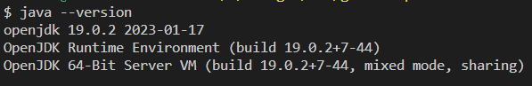

## Introduction à Java - Écrire votre premier programme Java
Dans cette leçon, nous allons apprendre à écrire et à exécuter un programme Java simple qui affichera le classique "Hello, World!" à l'écran.

### Étape 1 : Installation de l'environnement de développement Java
Avant de commencer, assurez-vous que vous avez Java Development Kit (JDK) installé sur votre ordinateur. Pour vérifier tapez la commande suivante dans un terminal:

```bash
java --version
```
Vous obtenez un résultat semblable au suivant



Vous pouvez télécharger la dernière version du JDK depuis le site officiel d'Oracle : [Télécharger le JDK](https://www.oracle.com/java/technologies/javase-downloads.html)

### Étape 2 : Configuration de votre environnement de développement

Ouvrez VS Code.

Écrivez le code Java suivant dans votre éditeur de texte :

```java
public class HelloWorld {
    public static void main(String[] args) {
        System.out.println("Hello, World!");
    }
}
```

Enregistrez ce fichier avec l'extension .java. Par exemple, HelloWorld.java.

Ouvrez l'invite de commande (CMD) et utilisez la commande cd pour naviguer jusqu'au répertoire où vous avez enregistré votre fichier Java.

Compilez le programme en utilisant la commande :

```bash
javac HelloWorld.java
```

Exécutez le programme en utilisant la commande :

```bash
java HelloWorld
```

Vous devriez voir "Hello, World!" s'afficher à l'écran.

Impecable ! Vous venez de créer le programme traditionnel "Hello World" en java. Dans la suite des exercices, nous allons découvrir davantage les spécificités du Java. 

La bonne nouvelle, c'est que vous tous les concepts abordés vous sont déjà familier ce qui facilite du coup l'apprentissage.
