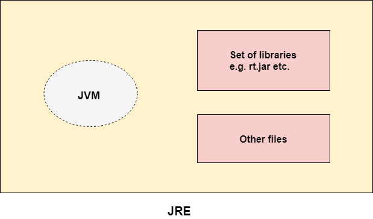
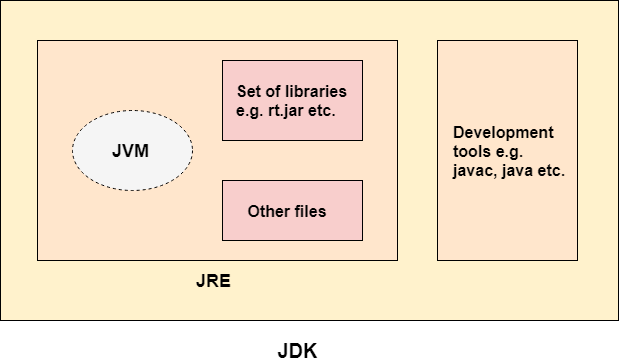

Avant d'aller plus loin, nous devrions connaitre la nuance entre certains termes utilisés: JVM, JRE et JDK. Comprendre ces trois éléments est simple quand on comprend leurs interactions.

## JVM, JRE et JDK
Lorsque vous écrivez du code source Java, il est généralement écrit en utilisant la syntaxe Java. `Le pseudocode` est une représentation simplifiée du code source Java, qui peut être utilisée pour expliquer le fonctionnement général d'un programme sans se soucier des détails de syntaxe Java. Voici un exemple simplifié :
#### Code source Java
```java
public class HelloWorld {
    public static void main(String[] args) {
        System.out.println("Hello, World!");
    }
}
```

#### Pseudocode
```bash
Définir une classe HelloWorld
    Définir une méthode principale
        Afficher "Hello, World!"
```

Une fois que vous avez écrit le code source Java, vous utilisez le JDK pour le compiler en bytecode. Le  `bytecode` est un ensemble d'instructions compréhensibles par la JVM. Le JDK fournit le compilateur Java (javac) pour effectuer cette transformation.

Une fois que le code source Java a été compilé en bytecode, vous pouvez exécuter le programme en utilisant la JVM. La JVM est responsable de l'exécution du bytecode sur une machine virtuelle Java. Voici comment cela fonctionne :

- Vous exécutez le bytecode en utilisant la commande java suivie du nom de la classe contenant la méthode principale (dans notre exemple, HelloWorld).
    
- La JVM charge le bytecode en mémoire et l'interprète ou le compile en code natif, en fonction de son implémentation spécifique.
    
- La JVM exécute le programme en suivant les instructions du bytecode, ce qui produit la sortie "Hello, World!" dans ce cas.
  
La JRE est un ensemble de bibliothèques et de fichiers nécessaires à l'exécution d'applications Java. Elle comprend également une instance de la JVM. Lorsque vous exécutez un programme Java en tant qu'utilisateur final, la JRE est utilisée pour fournir l'environnement d'exécution nécessaire. Vous n'avez pas besoin du JDK pour exécuter des applications Java, car la JRE est suffisante.

La JRE est un ensemble de bibliothèques et de fichiers nécessaires à l'exécution d'applications Java. Elle comprend également une instance de la JVM. Lorsque vous exécutez un programme Java en tant qu'utilisateur final, la JRE est utilisée pour fournir l'environnement d'exécution nécessaire. Vous n'avez pas besoin du JDK pour exécuter des applications Java, car la JRE est suffisante.
## Illustration JRE


## Illustration JDK

