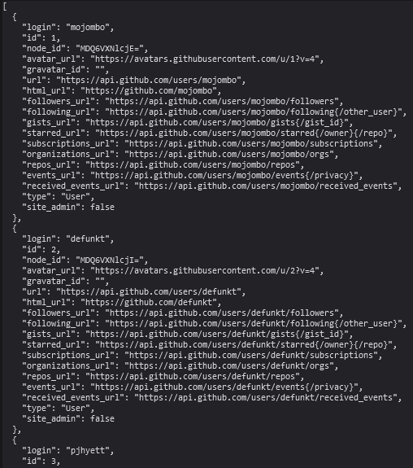

# Guide pour Utiliser l'API GitHub

Dans ce guide, vous découvrirez l'API GitHub qu'on utilisera plus tard pour récupérer des informations sur un utilisateur GitHub.

## Comprendre l'URL de l'API

L'API GitHub permet de récupérer des données sur un utilisateur.

Entrez l'URL suivante dans la barre de recherche de votre navigateur.
```sh
https://api.github.com/users
```

Vous obtenez un ensemble de données JSON comme indiqué ci-dessous:


Chacune des données que vous observez représente un utilisateur GitHub. Un utilisateur GitHub vraiment existant.
Si vous ne vous voyez pas, ce n'est pas grave; vous êtes spécial. Vous êtes sûrement un super-codeur qu'on ne peut trouver sur la toile à moins d'être surpuissant.
Pour vous retrouver, nous allons utiliser des codes que peut d'être humains connaissent.

 Utilisez l'URL suivante : `https://api.github.com/users/{username}`. 
 Remarquez que `{username}` doit être remplacé par le nom d'utilisateur GitHub que vous souhaitez récupérer. Par exemple, 
`[https:](https://api.github.com/users/OSWALD-LEXPERT)` renvoie les informations concernant `LEXPERT` pour ceux qui connaissent😄.


Personnalisez l'URL précédant en remplaçant {username} par le nom d'utilisateur GitHub de votre choix. Exécutez le code et observez les données renvoyées dans la console de votre navigateur.
Explorez les données renvoyées par l'API GitHub. Dans la suite des exercices vous verrez comment extraire des informations telles que le nom, la photo de profil, le nombre de repos, etc.

Voici donc ceux à quoi resemble des données d'une API. C'est tout ? Et oui ! En théorie...
